##### Tomasz Mycielski

# Zaawansowane systemy baz danych -- projekt

## Case study: Firma transportowa Eltrans

Eltrans to prężnie działająca firma transportowa, operująca zarówno na rynku krajowym, jak i międzynarodowym. Firma dysponuje liczną flotą, z czego większość stanowią tiry. Eltrans zatrudnia wielu pracowników, w większości kierowców, lecz także personel administracyjny, mechaników oraz specjalistów ds. logistyki.

Głównym wyzwaniem dla Eltrans jest efektywne zarządzanie flotą pojazdów i personelem. Firma potrzebuje narzędzia do monitorowania wydajności, optymalizacji tras, kontroli kosztów oraz wykrywania nadużyć (fraudów). Dodatkowo, Eltrans chce wzmocnić swoje możliwości analityczne, aby podejmować trafniejsze decyzje biznesowe oparte na danych.

Baza danych, która ma usprawnić działanie firmy, będzie centralnym punktem gromadzenia i analizy informacji o pracownikach, pojazdach, trasach i historycznym stanie pojazdów podczas całego cyklu ich eksploatacji. Dzięki niej, Eltrans będzie w stanie:

- Analizować pracę kierowców
- Monitorować wykorzystanie pojazdów
- Analizować opłacalność poszczególnych tras i zleceń, z uwzględnieniem specyfiki różnych typów pojazdów
- Generować raporty i analizy wspierające podejmowanie decyzji strategicznych
- Wykrywać nadużycia, których dopuszczają się pracownicy firmy

Wdrożenie tego systemu pozwoli Eltrans na zwiększenie efektywności operacyjnej, redukcję kosztów oraz poprawę jakości świadczonych usług. To z kolei przełoży się na wzmocnienie pozycji firmy na konkurencyjnym rynku transportowym, umożliwiając jej lepsze wykorzystanie zróżnicowanej floty pojazdów i efektywniejsze zarządzanie zasobami ludzkimi, oraz oczywiście zwiększenie zysków.

## RDBMS

Na potrzeby tego projektu do zarządzania relacyjną bazą danych wykorzystany zostanie system **PostgreSQL**. Używałem tego systemu już wcześniej i nie miałem z nim problemu. Postgres ma ogromną społeczność, więc nawet jeśli napotkam jakiś problem, to na pewno szybko znajdę jego rozwiązanie w internecie. Korzystanie z Postgresa jest darmowe (open source), a instalacja jest dziecinnie prosta. Korzystam z `helm` ([chart od Bitnami](https://bitnami.com/stack/postgresql/helm)) do utworzenia instancji Postgresa na moim klastrze `k3s`, do którego dostęp mam przez WireGuard (Tailscale).

Screenshoty z działającego Postgresa:

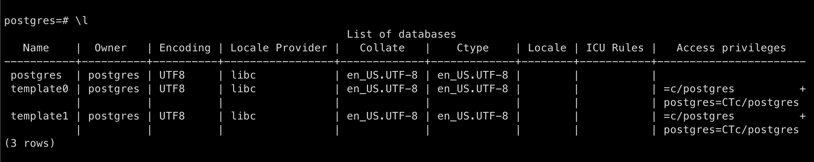
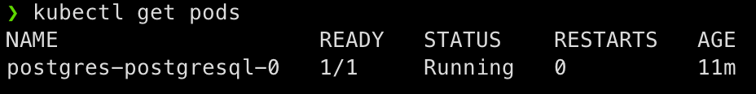

## Projekt bazy danych

### ERD

[](https://mermaid.live/edit#pako:eNp9ksGOgyAQhl-FzLl9AW-mkqxJ291otycvs4rVVMQAtjHquy9IWZs2WU7w55v55wdGyEXBIAAmoxovEnnWErNOSfzldmf6Ee_21MthvKeJO6Shl6MkPnv1QMP0O6EHejw5YRcmkW91jD4NtlqQWWy3YvJ9SUAy0HhlLbnXusrghZwmP85CFrK-_YO6qZ7An8Fib2O-tF5nKKXga4WN61GbyXIdDoqUQnr7Z8al9d0U6RrMGUHt2fV23itqpXqmVm8XhUyTua3xz70STbFAsAHOJMe6MC852hJjWjHOMljio7xabDYc9lqkQ5tDoGXPNiBFf6kgKLFR5tR3BWr2-AkPdf4Fgmqj0g)

## Implementacja bazy danych

Kod, który nie został umieszczony w tym sprawozdaniu dostępny jest na [GitHub](https://github.com/mycielski/zsbd_1).

### Schemat logiczny

[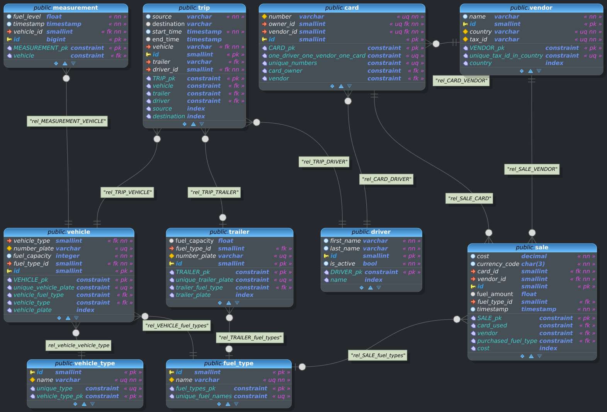

Wszystkie tabele są w jednym schemacie bazodanowym.

#### Tabele niezależne

1. `measurement`

    Zawiera pomiary poziomu paliwa podczas jazdy samochodu.

2. `trip`

    Zawiera informacje o trasach pokonanych przez samochody.

3. `card`

    Zawiera informacje o kartach flotowych, których używają kierowcy podczas transakcji na stacjach paliw.

4. `vendor`

    Zawiera informacje o dostawcach paliwa, z którymi firma ma podpisane umowy.

5. `vehicle`

    Zawiera informacje o samochodach, którymi operuje firma.

6. `trailer`

    Zawiera informacje o naczepach, którymi operuje firma.

7. `driver`

    Zawiera informacje o kierowcach zatrudnionych w firmie.

8. `sale`

    Zawiera informacje o transakcjach zakupu paliwa dokonanych przez kierowców.

#### Tablice słownikowe

1. `vehicle_type`
2. `fuel_type`

## Odstępstwa od 3NF

- W tabeli trip:
    - `source` i `destination` są przechowywane jako varchar zamiast referencji do tabeli locations

    Uzasadnienie:

    - Uniknięcie skomplikowanych joinów przy wyszukiwaniu tras
    - Lokalizacje mogą być bardzo zmienne i nie zawsze standardowe (np. adresy klientów)
    - Dodano indeksy hash aby przyspieszyć wyszukiwanie po tych kolumnach

- W tabeli `sale`:
    - `currency_code` jest przechowywane bezpośrednio zamiast referencji do tabeli walut

    Uzasadnienie:

    - Lista walut jest względnie stała (ISO 4217)
    - Uniknięcie dodatkowego joina przy każdym zapytaniu o sprzedaż
    - Typ `char(3)` zapewnia poprawny format kodu waluty

- W tabeli vendor:
    - `country` jest przechowywane jako varchar zamiast referencji do tabeli krajów

    Uzasadnienie:

    - Lista krajów jest względnie stała
    - Często używane w zapytaniach (dodano indeks hash)
    - Uniknięcie dodatkowego joina przy wielu zapytaniach

## Istotne decyzje projektowe
- Użycie `number_plate` jako klucza obcego w powiązaniach pojazdów i naczep z przejazdami:
    - Zamiast używać id, użyłem numeru rejestracyjnego jako klucza obcego
    - Uzasadnienie: Szybsze wyszukiwanie po numerach rejestracyjnych (które są często używane w biznesie transportowym) bez konieczności joinów


- Separacja `vehicle_type` i `fuel_type` do osobnych tabel:
    - Zamiast przechowywać te informacje jako teksty w tabeli vehicle
    - Uzasadnienie: zapewnia spójność danych


- Użycie timestamp zamiast datetime:
    - Uzasadnienie: Uniknięcie problemów ze strefami czasowymi (timestamp przechowuje UTC)


- Struktura kart paliwowych:
    - Karta jest powiązana zarówno z kierowcą jak i vendorem
    - Constraint `one_driver_one_vendor_one_card` zapewnia że kierowca może mieć tylko jedną kartę u danego vendora
    - Uzasadnienie: Odzwierciedla rzeczywisty model biznesowy gdzie kierowcy mogą mieć różne karty od różnych dostawców


## Generowanie danych

Do wygenerowania danych wykorzystałem własne skrypty SQL i Python. Aby zwiększyć realizm danych wielokrotnie wykorzystywałem losowanie z rozkładu normalnego (na przykład do generowania cen paliwa). Na szczególną uwagę zasługuje program, który generuje pomiary poziomu paliwa podczas przejazdów samochodów oraz zapisy transakcji zakupu paliwa dokonanych przez kierowców gdy poziom był niski.

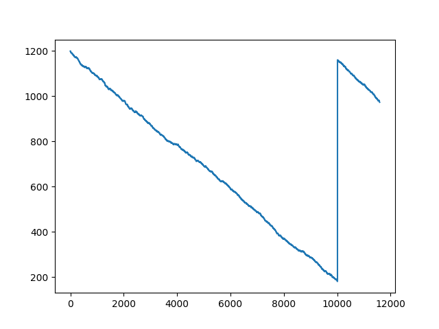

Widoczny na wykresie szum został wprowadzony do danych celowo w celu symulacji niedokładności przyrządów pomiarowych oraz zmiennego spalania pojazdu podczas podróży.

## Użytkownicy

Stworzyłem użytkowników symbolizujących działy w firmie.

```sql
CREATE USER financial WITH PASSWORD 'financial';
CREATE USER compliance WITH PASSWORD 'compliance';
```

Następnie nadałem im dostęp do widoków, które zostały stworzone dla ich działów.

```sql
GRANT SELECT ON <widok> TO <uzytkownik>
REVOKE ALL ON SCHEMA public FROM <uzytkownik> 
```

### Testy dostępów


## Przykładowe zapytania

### Którzy kierowcy wykonali najwięcej tras w danym miesiącu?

```sql
SELECT driver.first_name,
       driver.last_name,
       count(*) AS trips_taken
FROM driver
JOIN trip ON driver.id=trip.driver_id
WHERE trip.start_time>='2024-01-01'
  AND trip.end_time<'2024-02-01'
GROUP BY driver.first_name,
         driver.last_name
ORDER BY trips_taken DESC
LIMIT 10;
```
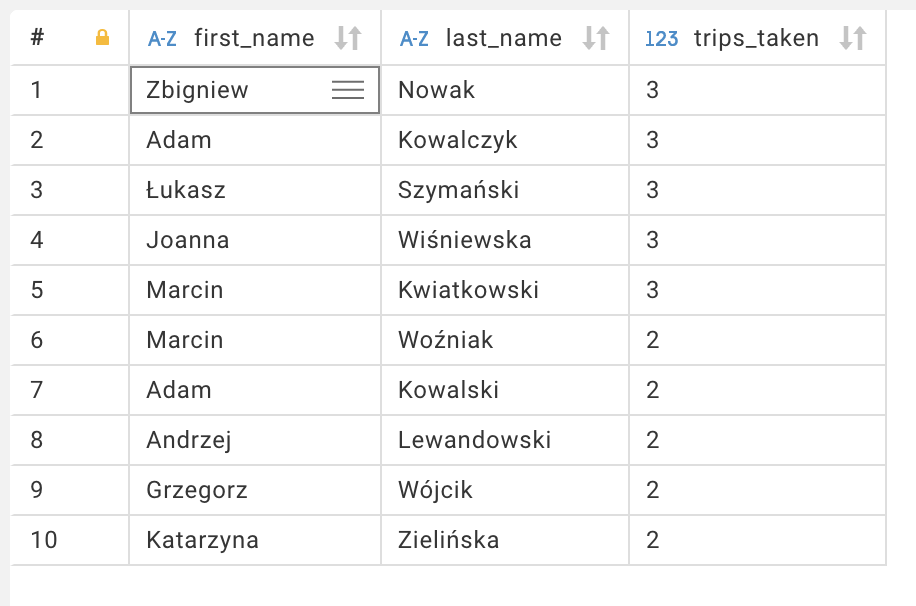

### Jaka jest średnia cena oleju napędowego w Polsce?

W tym zapytaniu wykorzystane zostało **podzapytanie**.

```sql
SELECT ft.name AS "Nazwa paliwa",
       ROUND(CAST(sum(cost) / sum(fuel_amount) AS numeric), 2) AS "Cena paliwa [EUR]"
FROM sale s
JOIN fuel_type ft ON ft.id = s.fuel_type_id
WHERE vendor_id IN
    (SELECT id
     FROM vendor
     WHERE country = 'Poland')
  AND ft.name = 'diesel'
GROUP BY ft.name;
```

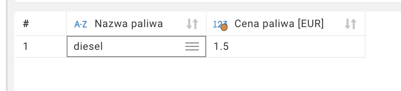

## Perspektywy

Utworzyłem sześć perspektyw.

### Wykrywanie fraudów

Kierowcy kupują paliwo na stacjach paliw przy użyciu firmowych kart flotowych. Kierowca może próbować zatankować część paliwa do własnego kanistra aby w ten sposób "dorobić" sobie bonus do pensji. Jest to oczywiście kradzież. W celu jej wykrywania stworzone zostały perspketywy.

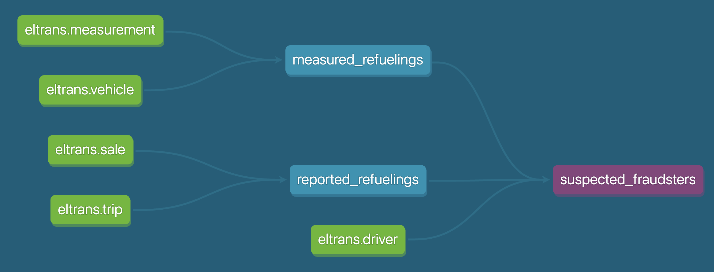

```sql
SELECT * FROM reported_refuelings;
```

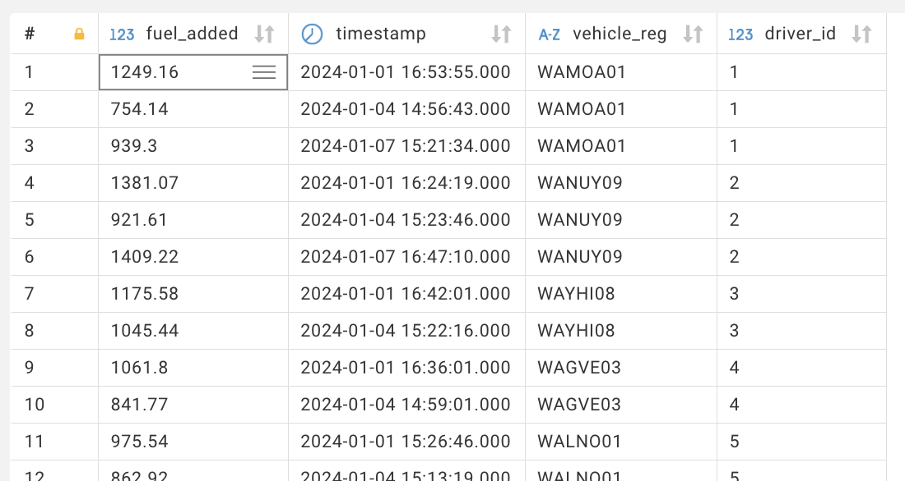

---

```sql
SELECT * FROM measured_refuelings;
```

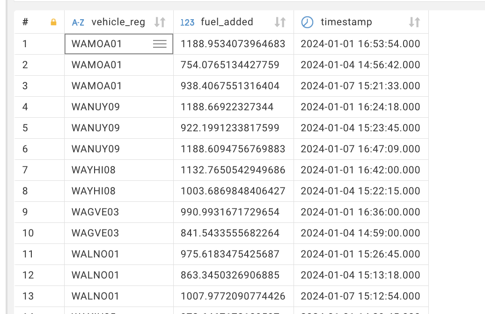

---

```sql
SELECT * FROM suspected_fraudsters;
```

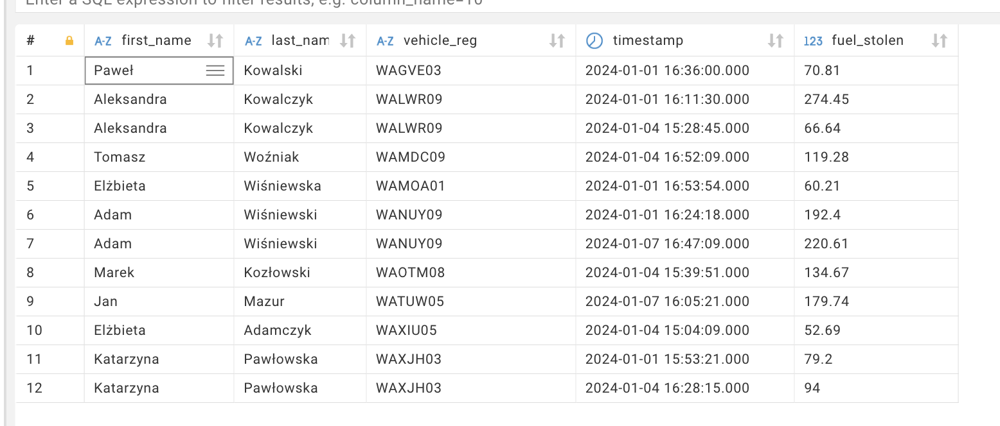


### Koszt paliwa na godzinę jazdy kierowcy

Firma chce nagradzać kierowców którzy wybierają tanie stacje i nie mają ciężkiej nogi. W tym celu skorzystać można z perspektyw, które informują o średnim koszcie paliwa spalonego przez danego kierowcę na godzinę jazdy.

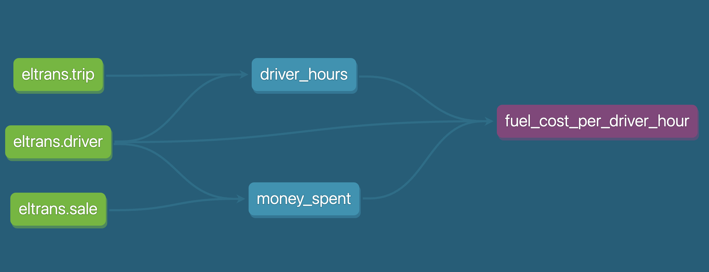

```sql
SELECT * FROM driver_hours;
```

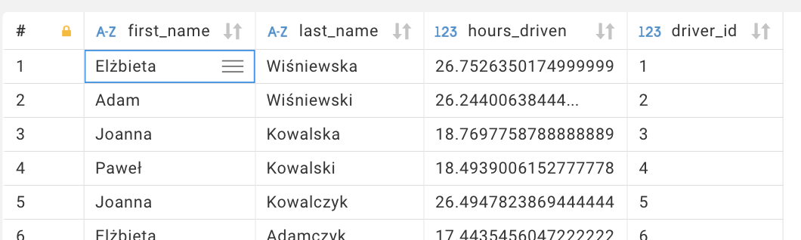

---

```sql
SELECT * FROM money_spent;
```

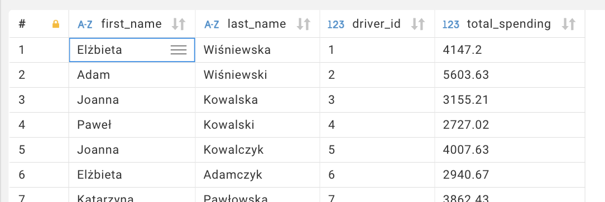

---

```sql
SELECT * FROM fuel_cost_per_driver_hour;
```

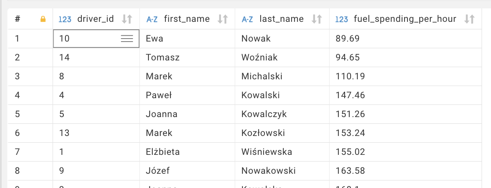


## Indeksy

W bazie stworzyłem indeksy aby przyspieszyć niektóre zapytania, które dają istotne informacje z punktu widzenia biznesowego. Tam, gdzie zapytania mają formę przyrównania do konkretnej wartości (na przykład numer rejestracyjny) wykorzystany został indeks typu hash. W przeciwnym wypadku (oraz w indeksie złożonym z kilku kolumn ponieważ takich nie obsługuje hash) wykorzystałem indeks btree.

### `trip`

Utworzone zostały indeksy typu hash na kolumnach `source` i `destination` aby przyspieszyć zapytania o miejsca, gdzie jeżdżą pojazdy.

### `vendor`

Utworzony został indeks typu hash na kolumnie `country` aby przyspieszyć zapytania o kraje w których zarejestrowane są działaności dostawców paliwa.

### `sale`

Utworzony został indeks btree na kolumnie `cost` zawierający wartości `cost`, `fuel_amount` i `vendor_id` aby przyspieszyć zapytania o średnie ceny paliwa u dostawców.

### `driver`

Utworzony został indeks złożony typu btree na kolumnach `first_name` i `last_name` aby przyspieszyć zapytania o kierowców przy użyciu ich imion (w przeciwieństwie do ich `id`).

### `vehicle` i `trailer`

W obu tabelach utworzono indeksy typu hash na kolumnach z numerami rejestracyjnymi.

## Benchmark

Bez indeksu na kolumnie `timestamp` w `measurement` wykonanie zapytania `SELECT min(m.timestamp) FROM measurement m` zajmowało około 900 milisekund. Po dodaniu indeksu btree na tę kolumnę czas wykonania tego zapytania spadł do 12 milisekund! To redukcja o niemal **99%**!

---
# Etap 2

## Procedura do dodawania kierowców

```sql
CREATE OR REPLACE PROCEDURE add_driver(
    p_first_name VARCHAR,
    p_last_name VARCHAR,
    p_is_active BOOLEAN DEFAULT true
)
LANGUAGE plpgsql
AS $$
BEGIN
    IF p_first_name IS NULL OR p_last_name IS NULL THEN
        RAISE EXCEPTION 'First name and last name cannot be null';
    END IF;

    INSERT INTO driver (first_name, last_name, is_active)
    VALUES (p_first_name, p_last_name, p_is_active);
END;
$$;
```

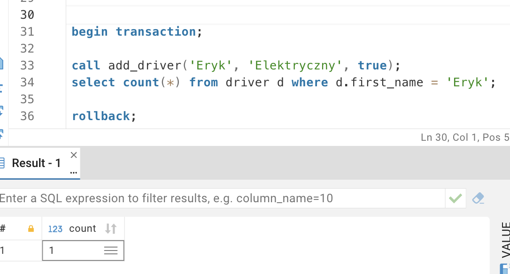

## Funkcja `eur_to_pln`

```sql
CREATE OR REPLACE FUNCTION eur_to_pln(amount numeric) 
RETURNS numeric 
LANGUAGE plpgsql
AS $$
BEGIN
    RETURN ROUND(amount * 4.37, 2);
END;
$$;
```

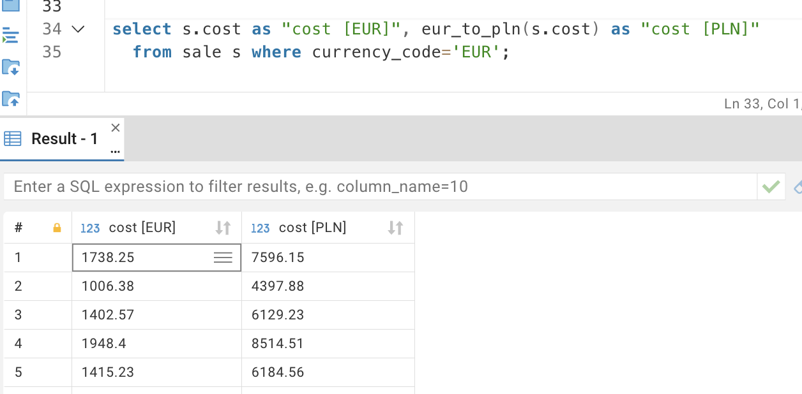

## Backup

```shell
PGPASSWORD=$POSTGRES_PASSWORD pg_dump -h 127.0.0.1 -p 5432 -U postgres -d eltrans > eltrans_backup_$(date +%Y%m%d).sql
```

Wykorzystałem program `pg_dump` do utworzenia kopii zapasowej mojej bazy danych. Poprawność utworzonej kopii zapasowej zweryfikowałem tworząc nowy klaster kubernetes (minikube), instalując tam Postgresa, a następnie wykonując plik .sql z kopią zapasową na tym Postgresie. 

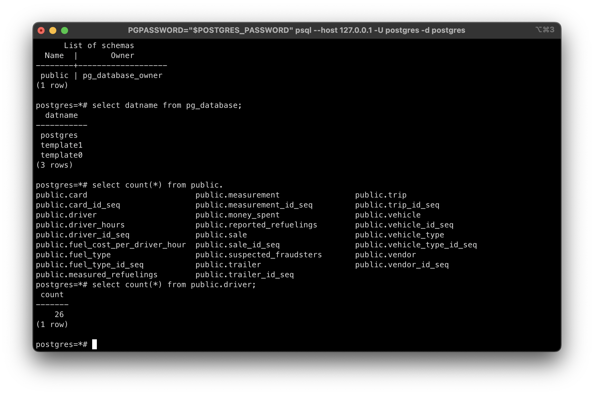

## Złożona procedura

```sql
CREATE OR REPLACE PROCEDURE add_fuel_card(
    p_driver_id integer,
    p_vendor_id integer,
    p_card_number varchar
)
LANGUAGE plpgsql
AS $$
DECLARE
    v_driver_exists boolean;
    v_is_active boolean;
    v_card_exists boolean;
BEGIN
    SELECT EXISTS (
        SELECT 1 
        FROM driver 
        WHERE id = p_driver_id::smallint
    ) INTO v_driver_exists;

    IF NOT v_driver_exists THEN
        RAISE EXCEPTION 'Driver with ID % does not exist', p_driver_id;
    END IF;

    SELECT is_active 
    FROM driver 
    WHERE id = p_driver_id::smallint 
    INTO v_is_active;

    IF NOT v_is_active THEN
        RAISE EXCEPTION 'Driver with ID % is not active', p_driver_id;
    END IF;

    SELECT EXISTS (
        SELECT 1
        FROM card
        WHERE owner_id = p_driver_id::smallint 
        AND vendor_id = p_vendor_id::smallint
    ) INTO v_card_exists;

    IF v_card_exists THEN
        RAISE EXCEPTION 'Driver % already has a fuel card with vendor %', p_driver_id, p_vendor_id;
    END IF;

    SELECT EXISTS (
        SELECT 1
        FROM card
        WHERE number = p_card_number
    ) INTO v_card_exists;

    IF v_card_exists THEN
        RAISE EXCEPTION 'Card number % is already in use', p_card_number;
    END IF;

    INSERT INTO card (number, owner_id, vendor_id)
    VALUES (p_card_number, p_driver_id::smallint, p_vendor_id::smallint);
    
    RAISE NOTICE 'Successfully added new fuel card for driver %', p_driver_id;

EXCEPTION
    WHEN foreign_key_violation THEN
        RAISE EXCEPTION 'Vendor with ID % does not exist', p_vendor_id;
        
    WHEN OTHERS THEN
        RAISE EXCEPTION 'An unexpected error occurred: %', SQLERRM;
END;
$$;
```

Ta procedura dodaje nową kartę dla kierowcy. Sprawdza ona najpierw:

- czy kierowca istnieje?
- czy kierowca jest aktywny?
- czy vendor istnieje? 
- czy kierowca nie ma już karty u tego vendora?

Wykorzystane są do tego tabele:

- driver
- card
- vendor

Procedura ma zaimplementowaną obsługę błędów. Przykład błędu związanego z dodaniem drugiej karty dla tego samego kierowcy u tego samego vendora:

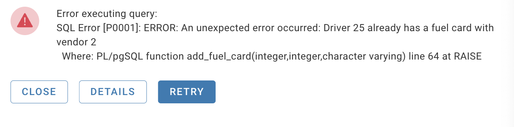

W Postgresie procedury domyślnie wykonują się w transakcji, nie trzeba tego implementować samodzielnie w samym kodzie procedury.

## Trigger

```sql
CREATE OR REPLACE FUNCTION validate_fuel_type()
RETURNS TRIGGER AS $$
DECLARE
    vehicle_fuel_type SMALLINT;
BEGIN
    SELECT v.fuel_type_id INTO vehicle_fuel_type
    FROM trip t
    JOIN vehicle v ON v.number_plate = t.vehicle
    WHERE t.driver_id = (SELECT owner_id FROM card WHERE id = NEW.card_id)
    ORDER BY t.start_time DESC 
    LIMIT 1;

    IF NEW.fuel_type_id != vehicle_fuel_type THEN
        RAISE EXCEPTION 'Invalid fuel type for vehicle. Expected fuel type ID: %', vehicle_fuel_type;
    END IF;

    RETURN NEW;
END;
$$ LANGUAGE plpgsql;

CREATE TRIGGER validate_fuel_type_trigger
    BEFORE INSERT ON sale
    FOR EACH ROW
    WHEN (NEW.fuel_type_id IS NOT NULL)
    EXECUTE FUNCTION validate_fuel_type();
```

Ten trigger uniemożliwia dodanie zakupu paliwa innego typu, niż przypisany do samochodu, którym porusza się dany kierowca.

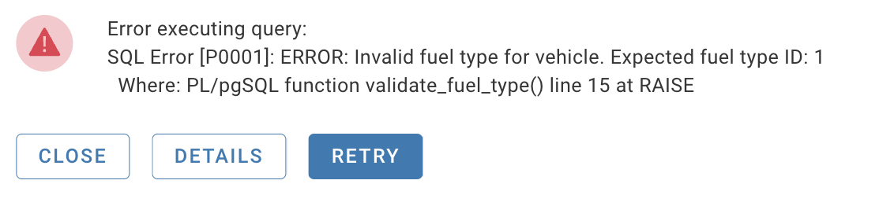

## Różnica między dialektami SQL Postgres i MySQL

1. Typy danych

```sql
-- PostgreSQL                    | MySQL
TIMESTAMP WITH TIME ZONE        | DATETIME (brak stref czasowych)
SERIAL                         | AUTO_INCREMENT
VARCHAR bez limitu             | VARCHAR wymaga limitu
NUMERIC/DECIMAL(p,s)           | DECIMAL(p,s) z mniej precyzyjnymi obliczeniami
ARRAY                         | Brak natywnych tablic
JSON, JSONB                    | JSON (przed MySQL 8.0 jako TEXT)
```

2. Funkcje

```sql
-- Konkatenacja stringów
-- PostgreSQL
SELECT 'Hello' || ' ' || 'World';

-- MySQL
SELECT CONCAT('Hello', ' ', 'World');

-- Praca z datami
-- PostgreSQL
SELECT EXTRACT(EPOCH FROM timestamp_column);

-- MySQL
SELECT UNIX_TIMESTAMP(timestamp_column);
```

2. Triggery

```sql
-- PostgreSQL
CREATE TRIGGER nazwa_triggera
AFTER INSERT ON tabela
FOR EACH ROW
EXECUTE FUNCTION nazwa_funkcji();

-- MySQL
CREATE TRIGGER nazwa_triggera
AFTER INSERT ON tabela
FOR EACH ROW
BEGIN
    -- kod triggera bezpośrednio tutaj
END;
```

- PostgreSQL wymaga osobnej funkcji dla triggera
- MySQL zawiera kod triggera bezpośrednio w definicji
- MySQL nie ma INSTEAD OF triggerów
- PostgreSQL pozwala na triggery na widokach

4. Sekwencje

```sql
-- PostgreSQL
CREATE SEQUENCE seq_name;
CREATE TABLE table_name (
    id integer DEFAULT nextval('seq_name')
);

-- MySQL
CREATE TABLE table_name (
    id integer AUTO_INCREMENT
);
```

Najważniejszą różnicą między Postgres a MySQL jest wykorzystanie wątków do obsługi połączeń z klientami w MySQL vs procesów w Postgres. Nie ma to jednak znaczenia dla nas przy migracji.

## Wybrane narzędzia do migracji

1. Airbyte

- Obsługa ponad 350 źródeł i miejsc docelowych danych
- Przyrostowa synchronizacja danych (przenosi tylko zmienione dane)
- Elastyczna obsługa schematów danych
- Możliwość budowania własnych konektorów
- Dostępne jako open-source

Wszechstronne narzędzie, szczególnie przydatne w przypadku złożonych migracji z wielu źródeł. Duża elastyczność dzięki możliwości tworzenia własnych konektorów.

2. Azure Migrate

- Dedykowane do migracji do chmury Azure
- Centralna kontrola projektów migracji
- Szacowanie kosztów migracji
- Optymalizacja wydajności w środowisku Azure
- Wiele dostępnych źródeł danych

Dobre narzędzie jeśli ktoś pracuje z Azure. Niestety płatne, ale za to daje dużo informacji o szacowanych kosztach.

3. AWS Database Migration Service

- Ciągła replikacja danych
- Albo batchowa
- Pełna integracja z usługami AWS
- Wiele dostępnych źródeł danych

Podobnie jak rozwiązanie od Azure, tylko w świecie AWS. 

## Migracja

### MySQL Workbench

Próba migracji przy użyciu narzędzia MySQL Workbench zakończyła się niepowodzeniem, zarówno na MacOS, NixOS, Ubuntu i Windows 10.

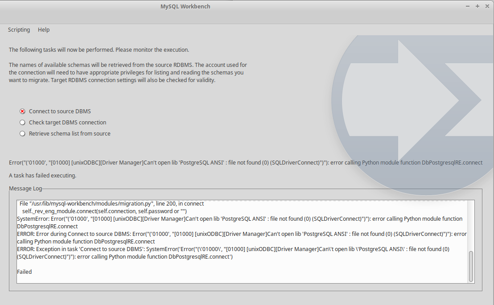

### Airbyte

Drugą próbę podjąłem przy użyciu narzędzia Airbyte. Zainstalowałem Airbyte na swoim komputerze i skonfigurowałem dostęp do obu RDBMSów. Migracja przy użyciu Airbyte jest czasochłonna -- moja baza miała niecałe $400 000$ rekordów i ważyła 33.5 MB, a jej migracja zajęła ponad 28 minut! Prawdopodobnie ze względu na niskowydajny sprzęt na którym są bazy. Na szczęście migracja jest dość prosta. Nie miałem żadnych problemów ze zmigrowaniem danych pomiędzy RDBMSami.

Dashboard Airbyte w trakcie migracji:

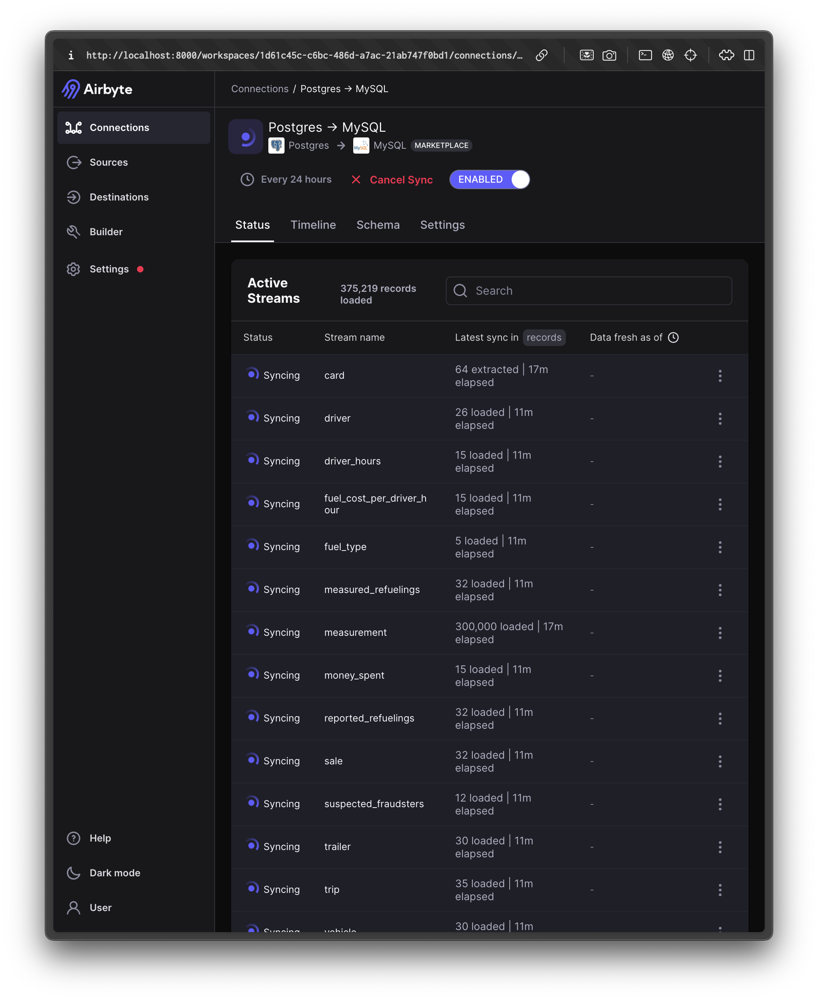

Informacja o udanej migracji:

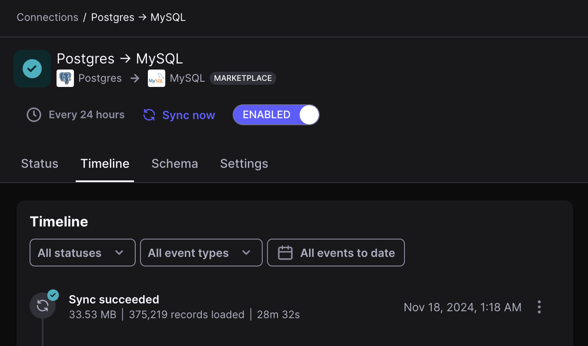

Liczba pomiarów poziomu paliwa w docelowym RDBMS jest poprawna:

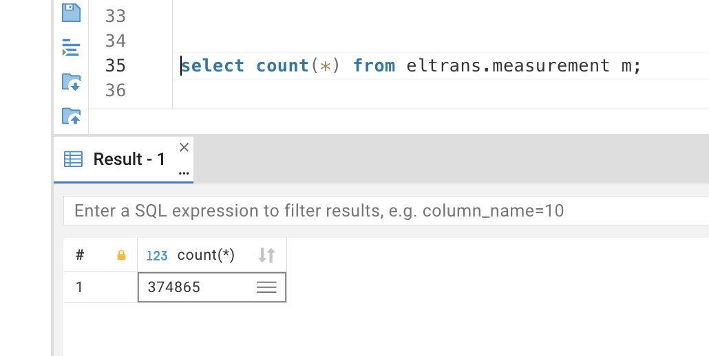

#### Database link

Przy użyciu Airbyte zrealizowałem także replikację danych co godzinę (choć da się nawet co minutę).

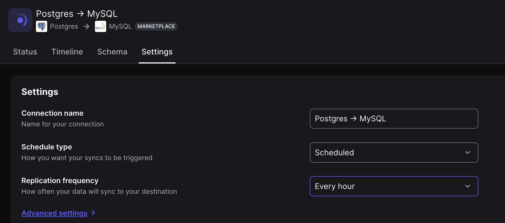

