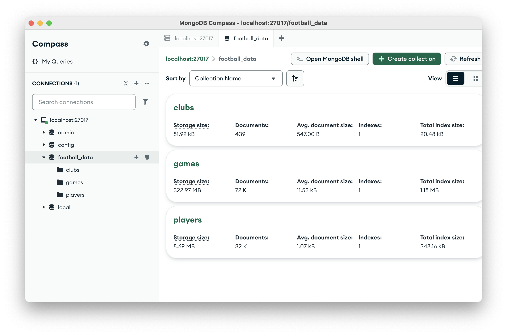
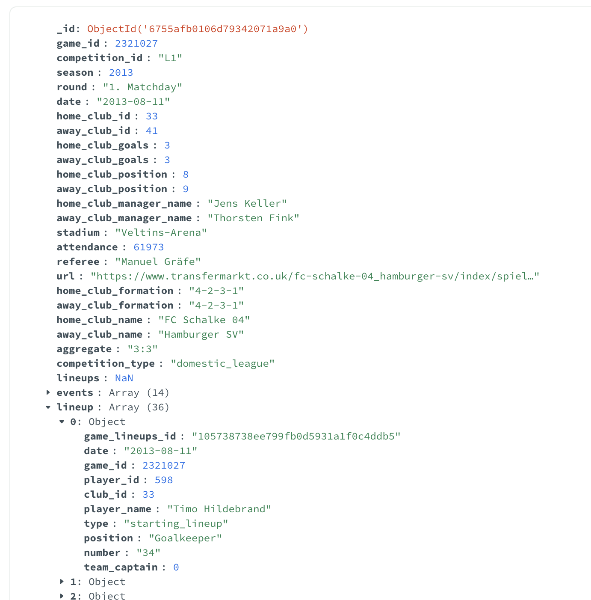
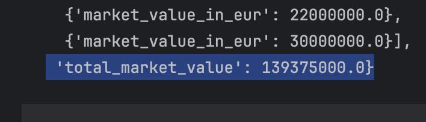
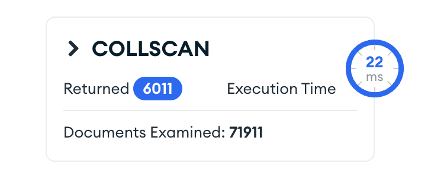
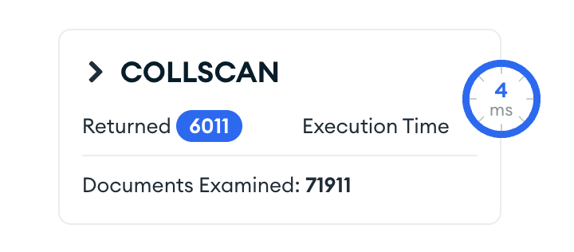
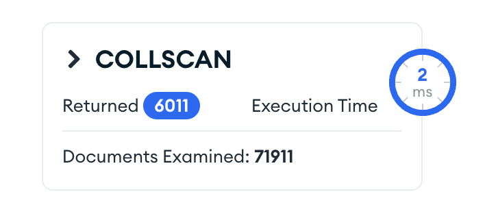
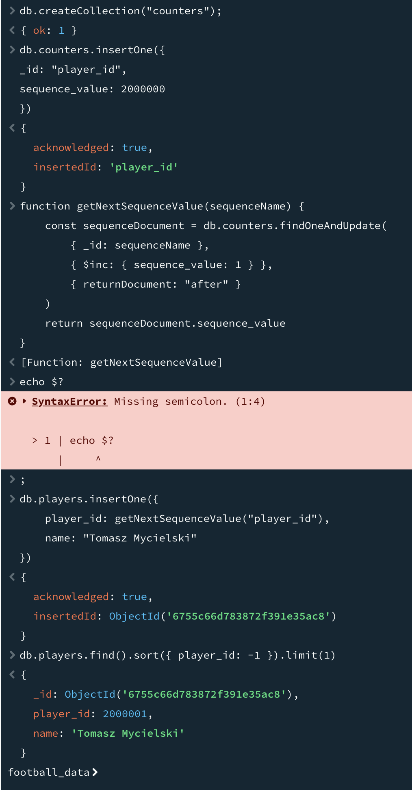
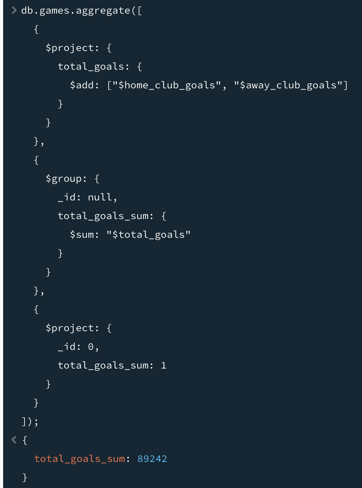
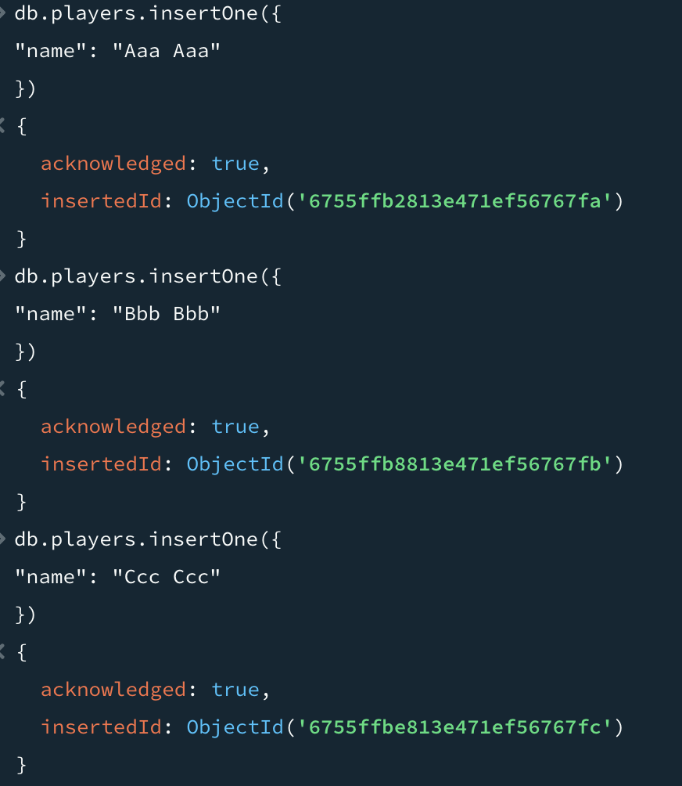
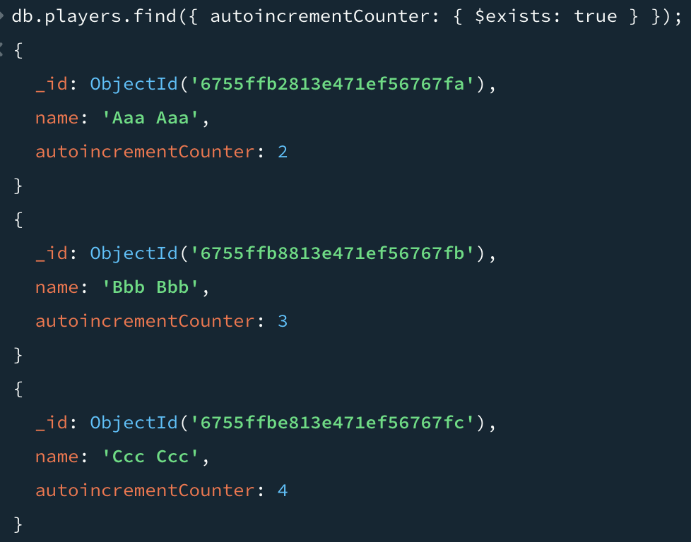

# Wykorzystanie bazy dokumentowej MongoDB

## Zbiór danych

[https://www.kaggle.com/datasets/davidcariboo/player-scores](https://www.kaggle.com/datasets/davidcariboo/player-scores)

Zbiór danych dotyczący meczy piłkarskich. Każdy mecz ma wiele zdarzeń, co pozwala na zagnieżdżenie. Zdarzenia mają sporo cech. Zbiór jest dosyć spory (miliony rekordów).

## Instalacja

Baza została zainstalowana w AWS, korzystając z rozwiązania Atlas od MongoDB.

## Upload danych do bazy

Napisałem program w Python, który umieszcza dane w bazie:

```python
import os

import kagglehub
import pandas as pd
from pymongo import MongoClient
from tqdm import tqdm

path = kagglehub.dataset_download("davidcariboo/player-scores")

clubs = pd.read_csv(os.path.join(path, "clubs.csv"))
game_events = pd.read_csv(os.path.join(path, "game_events.csv"))
game_lineups = pd.read_csv(os.path.join(path, "game_lineups.csv"))
games = pd.read_csv(os.path.join(path, "games.csv"))
player_valuations = pd.read_csv(os.path.join(path, "player_valuations.csv"))
players = pd.read_csv(os.path.join(path, "players.csv"))


client = MongoClient(os.getenv("MONGO_CONN_STR")
assert client.server_info()["ok"] == 1

db = client["football_data"]
db.list_collection_names()

clubs_collection = db["clubs"]
clubs_collection.insert_many(clubs.to_dict(orient="records"))

players_collection = db["players"]
players["valuations"] = (
    player_valuations.groupby("player_id")
    .apply(lambda x: x.to_dict(orient="records"))
    .to_dict()
)
players_collection.insert_many(players.to_dict(orient="records"))


for game in tqdm(games.iterrows(), total=games.shape[0]):
    game_row = game[1]
    lineup = game_lineups[game_lineups["game_id"] == game_row["game_id"]]
    events = game_events[game_events["game_id"] == game_row["game_id"]]
    game_dict = game_row.to_dict()
    game_dict["lineup"] = lineup.to_dict(orient="records")
    game_dict["events"] = events.to_dict(orient="records")
    db["games"].insert_one(game_dict)

```




Dane zostały zagnieżdżone w następujący sposób:

```
|
|-- players
|  |-- valuations
|
|-- clubs
|
|-- games
   |- events
   |- lineups
```

Zagnieżdżenie `events` i `lineups` w grach ma sens, ponieważ są one nierozłącznie powiązane z grami. `players` nie zostało zagnieżdżone w `clubs` ponieważ gracze mogą zmieniać kluby. `valuations` zostało zagnieżdżone w `players`, ponieważ wycena jest związana nierozłącznie z zawodnikiem.

### Zagnieżdżone dane

Przykład zagnieżdżenia `lineup` w `game`:



### Referencja

Poniższe zapytanie liczy sumę wartości wszystkich zawodników grających w danym meczu.

```json
{
        "$lookup": {
            "from": "players",
            "localField": "lineup.player_id",
            "foreignField": "player_id",
            "pipeline": [
                {"$project": {"market_value_in_eur": 1, "_id": 0}}
            ],
            "as": "player"
        }
    },
    {
        "$set": {
            "total_market_value": {
                "$sum": {
                    "$map": {
                        "input": "$player",
                        "as": "p",
                        "in": "$$p.market_value_in_eur"
                    }
                }
            }
        }
    },
    {
        "$limit": 100
}
```



## Analiza wydajności indeksów

Będę wykonywał poniższą kwerendę i sprawdzał jak na jej czas wykonania wpływa zakładanie indeksów.

```json
{
  $expr: { $gte: [{ $add: ["$home_club_goals", "$away_club_goals"] }, 6] }
}
```

### Bez indeksów



### Z indeksem na `away_club_goals`



### Z indeksami na `away_club_goals` i `home_club_goals`



## Autoinkrementacja

### Zaimplementowana za pomocą funkcji



## MapReduce

Próbowałem wykorzystać `mapReduce`, ale otrzymałem komunikat:

```
DeprecationWarning: Collection.mapReduce() is deprecated. Use an aggregation instead.
```

Wykorzystałem zatem agregację do policzenia ile goli zostało strzelonych:



## Autoinkrementacja

Stworzyłem trigger w bazie, który wywołuje poniższą funkcję.

```javascript
exports = async function(changeEvent) {
    var docId = changeEvent.fullDocument._id;
    
    const countercollection = context.services.get("Cluster0").db(changeEvent.ns.db).collection("counters");
    const playerscollection = context.services.get("Cluster0").db(changeEvent.ns.db).collection(changeEvent.ns.coll);
    
    var counter = await countercollection.findOneAndUpdate({_id: changeEvent.ns },{ $inc: { seq_value: 1 }}, { returnNewDocument: true, upsert : true});
    var updateRes = await playerscollection.updateOne({_id : docId},{ $set : {autoincrementCounter : counter.seq_value}});
    
    console.log(`Updated ${JSON.stringify(changeEvent.ns)} with counter ${counter.seq_value} result : ${JSON.stringify(updateRes)}`);
    };
```

### Prezentacja działania

Najpierw dodaję trzech nowych graczy:


Potem sprawdzam ich liczniki:

