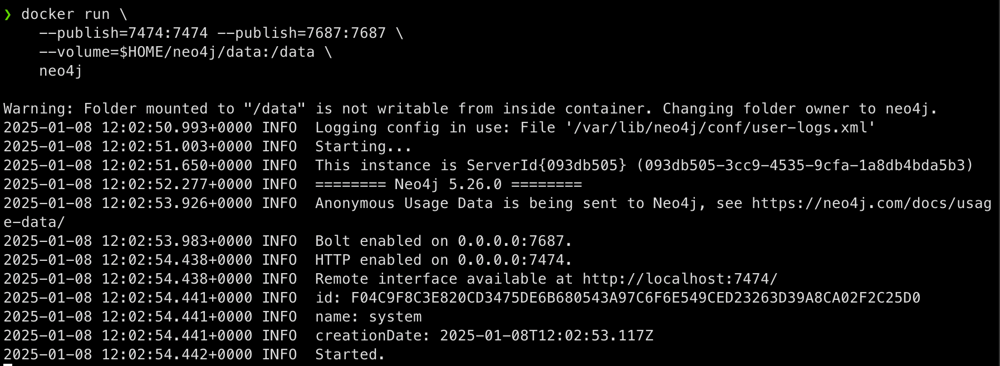

# Projekt 4 -- Neo4j

## Instalacja
Wykorzystałem oficjalny obraz Neo4j z Dockerhub.


## Zbiory danych
Do realizacji zadania wykorzystałem zbiory danych ze strony [openflights.org](https://openflights.org/):

- airports
- airlines
- routes
- planes
- countries

Mam zamiar wykorzystać zbiory `airports` i `routes` do stworzenia grafu lotnisk i połączeń między nimi.

Typy węzłów utworzone z tych zbiorów:

- Airline
- City
- Country
- PlaneType
- Terminal
- Timezone

Łącznie $11351$ węzłów.

Typy relacji pomiędzy zbiorami:

- BASED\_FROM
- IN\_TIMEZONE
- LOCATED\_IN
- OPERATES
- FLIGHT\_TO

Łącznie $23486$ relacji.

### Schemat danych


## Przykład tworzenia węzłów i połączeń

```python
with driver.session() as session:
    for _, row in tqdm(terminals_df.iterrows(), total=len(terminals_df)):
        session.run(
            "CREATE (t:Terminal {airport_id: $airport_id, name: $name, iata: $iata, icao: $icao, latitude: $latitude, longitude: $longitude, altitude: $altitude, type: $type, source: $source})",
            airport_id=row["airport_id"],
            name=row["name"],
            iata=row["iata"],
            icao=row["icao"],
            latitude=row["latitude"],
            longitude=row["longitude"],
            altitude=row["altitude"],
            timezone=row["timezone"],
            type=row["type"],
            source=row["source"],
        )
        # create timezone node
        session.run("MERGE (tz:Timezone {name: $name})", name=row["timezone"])
        # create city node
        session.run("MERGE (c:City {name: $city})", city=row["city"])
        # match city with timezone
        session.run(
            """
            MATCH (c:City {name: $city}),
                  (tz:Timezone {name: $timezone})
            MERGE (c)-[:IN_TIMEZONE]->(tz)
            """,
            city=row["city"],
            timezone=row["timezone"],
        )
        # match terminal with timezone
        session.run(
            """
            MATCH (t:Terminal {iata: $iata}),
                  (tz:Timezone {name: $timezone})
            MERGE (t)-[:IN_TIMEZONE]->(tz)
            """,
            iata=row["iata"],
            timezone=row["timezone"],
        )
        # match terminal with city
        session.run(
            """
            MATCH (t:Terminal {iata: $iata}),
                  (c:City {name: $city})
            MERGE (t)-[:LOCATED_IN]->(c)
            """,
            iata=row["iata"],
            city=row["city"],
        )
        # match terminal with country
        session.run(
            """
            MATCH (t:Terminal {iata: $iata}),
                  (c:Country {name: $country})
            MERGE (t)-[:LOCATED_IN]->(c)
            """,
            iata=row["iata"],
            country=row["country"],
        )
        # match city with country
        session.run(
            """
            MATCH (c:City {name: $city}),
                  (c:Country {name: $country})
            MERGE (c)-[:LOCATED_IN]->(c)
            """,
            city=row["city"],
            country=row["country"],
        )
```

## Funkcje przestrzenne

W moim zbiorze danych terminals zawarte są informacje o współrzędnych geograficznych lotniska. Dzięki temu można wykorzystać funkcje przestrzenne dostępne w Neo4j.

Wykorzystałem je do obliczania długości lotu między dwoma lotniskami w relacji `FLIGHT_TO`:

```python
with driver.session() as session:
    for _, row in tqdm(routes_df.iterrows(), total=len(routes_df)):
        if row["stops"] > 1:
            continue
        session.run(
            """
            MATCH (source:Terminal {iata: $source_airport}),
                  (destination:Terminal {iata: $destination_airport}),
                  (airline:Airline {iata: $airline})
            MERGE (source)-[:FLIGHT_TO {iata: $airline, distance: point.distance(source.location, destination.location), plane: $equipment}]->(destination)
            """,
            source_airport=row["source_airport"],
            destination_airport=row["destination_airport"],
            airline=row["airline"],
            equipment=row["equipment"],
        )
```

## Zapytanie z agregacją (`reduce`) i najkrótszą ścieżką

Ile kilometrów musimy przelecieć aby dostać się z lotniska Longreach do lotniska Perth International?
```sql
MATCH p = SHORTEST 1 (a:Terminal)-[:FLIGHT_TO*]->(b:Terminal)
WHERE a.iata = "LRE" AND b.iata = "PER"
RETURN reduce(total = 0, r IN relationships(p) | total + r.distance)/1000 AS result_km
```
```sql
╒═════════════════╕
│result_km        │
╞═════════════════╡
│22035.34801551281│
└─────────────────┘
```

Domyślnie Neo4j używa szybkiego dwukierunkowego algorytmu BFS ($O(V+E)$) do znalezienia najkrótszej ścieżki[1](https://neo4j.com/docs/cypher-manual/current/appendix/tutorials/shortestpath-planning/), są natomiast dostępne inne algorytmy, takie jak Dijkstra czy A*.

Istotną zaletą wykorzystania danych przestrzennych jest możliwość wykorzystania funkcji Neo4j do obliczania odległości między węzłami. Nie musimy implementować logiki samodzielnie, wystarczy wywołać wbudowaną funkcję `point.distance`.