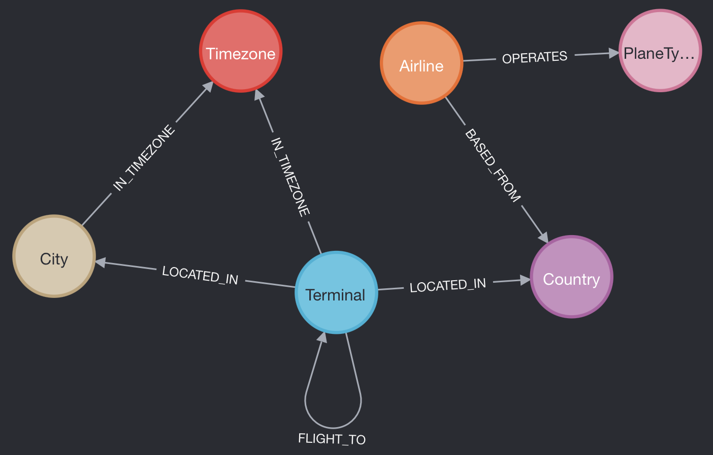

# Projekt 4 -- Neo4j

## Instalacja
Wykorzystałem oficjalny obraz Neo4j z Dockerhub, który uruchomiłem tą komendą:
```shell
$ docker run \
    --publish=7474:7474 --publish=7687:7687 \
    --volume=$HOME/neo4j/data:/data \
    --memory=8g \
    --env NEO4J_db_memory_transaction_total_max=4G \
    -e NEO4J_apoc_export_file_enabled=true \
    -e NEO4J_apoc_import_file_enabled=true \
    -e NEO4J_apoc_import_file_use__neo4j__config=true \
    -e NEO4J_PLUGINS='["apoc"]' \
    neo4j
```
Odbyło się to bez żadnych problemów.

## Zbiory danych
Do realizacji zadania wykorzystałem zbiory danych ze strony [openflights.org](https://openflights.org/):

- airports
- airlines
- routes
- planes
- countries

Mam zamiar wykorzystać zbiory `airports` i `routes` do stworzenia grafu lotnisk i połączeń między nimi.

Typy węzłów utworzone z tych zbiorów:

- Airline
- City
- Country
- PlaneType
- Terminal
- Timezone

Łącznie $11351$ węzłów.

Typy relacji pomiędzy zbiorami:

- BASED\_FROM
    - W jakim kraju dana linia lotnicza ma swoją siedzibę.
- IN\_TIMEZONE
    - Z której strefy czasowej dane miasto/lotnisko.
- LOCATED\_IN
    - Gdzie znajduje się dane miasto/lotnisko.
- OPERATES
    - Jakie samoloty obsługuje dana linia lotnicza.
- FLIGHT\_TO
    - Połączenia lotnicze istniejące między lotniskami.

Łącznie $23486$ relacji.

### Schemat danych



**Cały kod wykorzystany do załadowania danych i utworzenia relacji dostępny jest w serwisie GitHub pod adresem [https://github.com/mycielski/zsbd/blob/main/projekt_4/import.ipynb](https://github.com/mycielski/zsbd/blob/main/projekt_4/import.ipynb).**

## Przykład tworzenia węzłów i połączeń

```python
with driver.session() as session:
    for _, row in tqdm(terminals_df.iterrows(), total=len(terminals_df)):
        session.run(
            "CREATE (t:Terminal {airport_id: $airport_id, name: $name, iata: $iata, icao: $icao, latitude: $latitude, longitude: $longitude, altitude: $altitude, type: $type, source: $source})",
            airport_id=row["airport_id"],
            name=row["name"],
            iata=row["iata"],
            icao=row["icao"],
            latitude=row["latitude"],
            longitude=row["longitude"],
            altitude=row["altitude"],
            timezone=row["timezone"],
            type=row["type"],
            source=row["source"],
        )
        # create timezone node
        session.run("MERGE (tz:Timezone {name: $name})", name=row["timezone"])
        # create city node
        session.run("MERGE (c:City {name: $city})", city=row["city"])
        # match city with timezone
        session.run(
            """
            MATCH (c:City {name: $city}),
                  (tz:Timezone {name: $timezone})
            MERGE (c)-[:IN_TIMEZONE]->(tz)
            """,
            city=row["city"],
            timezone=row["timezone"],
        )
        # match terminal with timezone
        session.run(
            """
            MATCH (t:Terminal {iata: $iata}),
                  (tz:Timezone {name: $timezone})
            MERGE (t)-[:IN_TIMEZONE]->(tz)
            """,
            iata=row["iata"],
            timezone=row["timezone"],
        )
        # match terminal with city
        session.run(
            """
            MATCH (t:Terminal {iata: $iata}),
                  (c:City {name: $city})
            MERGE (t)-[:LOCATED_IN]->(c)
            """,
            iata=row["iata"],
            city=row["city"],
        )
        # match terminal with country
        session.run(
            """
            MATCH (t:Terminal {iata: $iata}),
                  (c:Country {name: $country})
            MERGE (t)-[:LOCATED_IN]->(c)
            """,
            iata=row["iata"],
            country=row["country"],
        )
        # match city with country
        session.run(
            """
            MATCH (c:City {name: $city}),
                  (c:Country {name: $country})
            MERGE (c)-[:LOCATED_IN]->(c)
            """,
            city=row["city"],
            country=row["country"],
        )
```

## Zapytania

1. Które popularne lotniska (minimum 30 połączeń) nie są ze sobą połączone?
```sql
MATCH (t1:Terminal)-[r:FLIGHT_TO]->(t2:Terminal)
WITH t1, count(r) as routes_count
WHERE routes_count > 30
WITH collect(t1) as major_airports
UNWIND major_airports as airport1
UNWIND major_airports as airport2
WITH airport1, airport2
WHERE airport1 <> airport2
AND NOT (airport1)-[:FLIGHT_TO]->(airport2)
RETURN 
    airport1.name as Airport1,
    airport1.iata as IATA1,
    airport2.name as Airport2,
    airport2.iata as IATA2,
    point.distance(airport1.location, airport2.location)/1000 as Distance_KM
ORDER BY Distance_KM
LIMIT 10
```
```text
╒════════════════════════════════╤═════╤════════════════════════════════╤═════╤═════════════════╕
│Airport1                        │IATA1│Airport2                        │IATA2│Distance_KM      │
╞════════════════════════════════╪═════╪════════════════════════════════╪═════╪═════════════════╡
│"Narita International Airport"  │"NRT"│"OR Tambo International Airport"│"JNB"│13598.58493382201│
├────────────────────────────────┼─────┼────────────────────────────────┼─────┼─────────────────┤
│"OR Tambo International Airport"│"JNB"│"Narita International Airport"  │"NRT"│13598.58493382201│
└────────────────────────────────┴─────┴────────────────────────────────┴─────┴─────────────────┘
```
To zapytanie sugeruje, że między tymi dwoma lotniskami warto otworzyć nowe połączenie.

2. Które państwa są najlepiej skomunikowane, czyli które państwa mają najwięcej połączeń międzynarodowych?
```sql
MATCH (c1:Country)<-[:LOCATED_IN]-(t1:Terminal)-[r:FLIGHT_TO]->(t2:Terminal)-[:LOCATED_IN]->(c2:Country)
WHERE c1 <> c2
WITH c1.name as country, count(DISTINCT c2) as connections
RETURN country, connections
ORDER BY connections DESC
LIMIT 3
```
```text
╒══════════════════════╤═══════════╕
│country               │connections│
╞══════════════════════╪═══════════╡
│"Switzerland"         │28         │
├──────────────────────┼───────────┤
│"United Arab Emirates"│26         │
├──────────────────────┼───────────┤
│"Belgium"             │23         │
└──────────────────────┴───────────┘
```

3. Które linie lotnicze mają najbardziej zróżnicowaną flotę samolotów?
```sql
MATCH (a:Airline)-[op:OPERATES]->(p:PlaneType)
WITH 
    a.name as airline_name, 
    a.iata as airline_code,
    COUNT(DISTINCT p) as plane_type_count,
    COLLECT(DISTINCT p.name) as fleet
RETURN 
    airline_name as Airline,
    airline_code as IATA,
    plane_type_count as Number_of_Plane_Types,
    fleet as Fleet_List
ORDER BY plane_type_count DESC
LIMIT 5
```
```text
╒══════════════════════════════╤════╤═════════════════════╤══════════════════════════════════════════════════════════════════════╕
│Airline                       │IATA│Number_of_Plane_Types│Fleet_List                                                            │
╞══════════════════════════════╪════╪═════════════════════╪══════════════════════════════════════════════════════════════════════╡
│"All Nippon Airways"          │"NH"│21                   │["McDonnell Douglas MD-90", "Boeing 777-300ER", "Boeing 777-200", "Boe│
│                              │    │                     │ing 767-300", "Boeing 737-700", "Airbus A321", "Boeing 737-500", "De H│
│                              │    │                     │avilland Canada DHC-8-200 Dash 8 / 8Q", "Airbus A340-300", "Boeing 747│
│                              │    │                     │-400", "Boeing 777-200LR", "Boeing 787-8", "Airbus A319", "Boeing 737-│
│                              │    │                     │800", "Airbus A320", "Boeing 777-300", "Airbus A330-300", "Airbus A300│
│                              │    │                     │-600", "Boeing 737-400", "Canadair Regional Jet 700", "Airbus A330-200│
│                              │    │                     │"]                                                                    │
├──────────────────────────────┼────┼─────────────────────┼──────────────────────────────────────────────────────────────────────┤
│"Scandinavian Airlines System"│"SK"│17                   │["Embraer 170", "Airbus A320", "Boeing 717", "De Havilland Canada DHC-│
│                              │    │                     │8-300 Dash 8", "Boeing 767-300", "Boeing 777-200", "Canadair Regional │
│                              │    │                     │Jet 200", "Canadair Regional Jet 900", "De Havilland Canada DHC-8-400 │
│                              │    │                     │Dash 8Q", "Boeing 737-800", "Aerospatiale/Alenia ATR 72", "Saab SF340A│
│                              │    │                     │/B", "Saab 2000", "Boeing 757-200", "British Aerospace ATP", "Airbus A│
│                              │    │                     │330-300", "Boeing 787-8"]                                             │
├──────────────────────────────┼────┼─────────────────────┼──────────────────────────────────────────────────────────────────────┤
│"Qantas"                      │"QF"│15                   │["Boeing 767-300", "Boeing 737-800", "Boeing 787-8", "Boeing 777-200",│
│                              │    │                     │ "Airbus A319", "Airbus A330-200", "De Havilland Canada DHC-8-300 Dash│
│                              │    │                     │ 8", "Airbus A380-800", "Embraer 170", "Airbus A320", "Airbus A340-300│
│                              │    │                     │", "De Havilland Canada DHC-8-400 Dash 8Q", "Fokker 50", "Boeing 717",│
│                              │    │                     │ "Boeing 777-300ER"]                                                  │
├──────────────────────────────┼────┼─────────────────────┼──────────────────────────────────────────────────────────────────────┤
│"Japan Airlines"              │"JL"│15                   │["Airbus A340-300", "Boeing 767-300", "Boeing 737-800", "Boeing 777-20│
│                              │    │                     │0", "Boeing 777-300", "Boeing 747-400", "Airbus A330-200", "Airbus A33│
│                              │    │                     │0-300", "Boeing 737-900", "Airbus A319", "Airbus A320", "Airbus A321",│
│                              │    │                     │ "Embraer 190", "Boeing 737-400", "Embraer 170"]                      │
├──────────────────────────────┼────┼─────────────────────┼──────────────────────────────────────────────────────────────────────┤
│"South African Airways"       │"SA"│14                   │["Airbus A319", "Boeing 737-800", "Boeing 747-400", "Boeing 777-200", │
│                              │    │                     │"De Havilland Canada DHC-8-400 Dash 8Q", "Canadair Regional Jet 700", │
│                              │    │                     │"British Aerospace Jetstream 41", "Canadair Regional Jet 200", "Boeing│
│                              │    │                     │ 777-300ER", "Avro RJ85", "Embraer RJ135", "Embraer Legacy 600", "Boei│
│                              │    │                     │ng 777-200LR", "Boeing 767-300"]                                      │
└──────────────────────────────┴────┴─────────────────────┴──────────────────────────────────────────────────────────────────────┘
```

4. Lista lotów z podziałem na krajowe i międzynarodowe dla danego państwa.

W moim przykładzie dla Norwegii. **To zapytanie wykorzystuje UNION**.
```sql
// Domestic
MATCH (t1:Terminal)-[r:FLIGHT_TO]->(t2:Terminal),
      (t1)-[:LOCATED_IN]->(c:Country),
      (t2)-[:LOCATED_IN]->(c)
WHERE c.name = "Norway"
RETURN 
t1.iata as From,
t2.iata as To,
'Domestic' as Flight_Type

UNION

// International
MATCH (t1:Terminal)-[r:FLIGHT_TO]->(t2:Terminal),
      (t1)-[:LOCATED_IN]->(c1:Country),
      (t2)-[:LOCATED_IN]->(c2:Country)
WHERE c1 <> c2 AND c1.name = "Norway"
RETURN 
t1.iata as From,
t2.iata as To,
'International' as Flight_Type
```
```text
╒═════╤═════╤═══════════════╕
│From │To   │Flight_Type    │
╞═════╪═════╪═══════════════╡
│"TRD"│"TRF"│"Domestic"     │
├─────┼─────┼───────────────┤
│"TRF"│"SVG"│"Domestic"     │
├─────┼─────┼───────────────┤
│"BGO"│"FRA"│"International"│
├─────┼─────┼───────────────┤
│"BGO"│"ABZ"│"International"│
├─────┼─────┼───────────────┤
│"KRS"│"CPH"│"International"│
├─────┼─────┼───────────────┤
│"OSL"│"TLL"│"International"│
├─────┼─────┼───────────────┤
│"OSL"│"SVO"│"International"│
├─────┼─────┼───────────────┤
│"OSL"│"RIX"│"International"│
├─────┼─────┼───────────────┤
│"OSL"│"HEL"│"International"│
├─────┼─────┼───────────────┤
│"OSL"│"GOT"│"International"│
├─────┼─────┼───────────────┤
│"HAU"│"CPH"│"International"│
├─────┼─────┼───────────────┤
│"TRF"│"CPH"│"International"│
├─────┼─────┼───────────────┤
│"TRD"│"TLL"│"International"│
├─────┼─────┼───────────────┤
│"SVG"│"NCL"│"International"│
├─────┼─────┼───────────────┤
│"SVG"│"FRA"│"International"│
├─────┼─────┼───────────────┤
│"SVG"│"ARN"│"International"│
└─────┴─────┴───────────────┘
```

5. Połączenie `MERGE` miasta ze strefą czasową.
```sql
MATCH (c:City {name: $city}),
      (tz:Timezone {name: $timezone})
MERGE (c)-[:IN_TIMEZONE]->(tz)
```

## Funkcje przestrzenne

W moim zbiorze danych terminals zawarte są informacje o współrzędnych geograficznych lotniska. Dzięki temu można wykorzystać funkcje przestrzenne dostępne w Neo4j.

Wykorzystałem je do obliczania długości lotu między dwoma lotniskami w relacji `FLIGHT_TO`:

```python
with driver.session() as session:
    for _, row in tqdm(routes_df.iterrows(), total=len(routes_df)):
        if row["stops"] > 1:
            continue
        session.run(
            """
            MATCH (source:Terminal {iata: $source_airport}),
                  (destination:Terminal {iata: $destination_airport}),
                  (airline:Airline {iata: $airline})
            MERGE (source)-[:FLIGHT_TO {iata: $airline, distance: point.distance(source.location, destination.location), plane: $equipment}]->(destination)
            """,
            source_airport=row["source_airport"],
            destination_airport=row["destination_airport"],
            airline=row["airline"],
            equipment=row["equipment"],
        )
```

## Zapytanie z agregacją `reduce()` i najkrótszą ścieżką

Ile kilometrów musimy przelecieć aby dostać się z lotniska Longreach do lotniska Perth International?
```sql
MATCH p = SHORTEST 1 (a:Terminal)-[:FLIGHT_TO*]->(b:Terminal)
WHERE a.iata = "LRE" AND b.iata = "PER"
RETURN reduce(total = 0, r IN relationships(p) | total + r.distance)/1000 AS result_km
```
```sql
╒═════════════════╕
│result_km        │
╞═════════════════╡
│22035.34801551281│
└─────────────────┘
```

Domyślnie Neo4j używa szybkiego dwukierunkowego algorytmu BFS ($O(V+E)$) do znalezienia najkrótszej ścieżki[1](https://neo4j.com/docs/cypher-manual/current/appendix/tutorials/shortestpath-planning/), są natomiast dostępne inne algorytmy, takie jak Dijkstra czy A*.

Istotną zaletą wykorzystania danych przestrzennych jest możliwość wykorzystania funkcji Neo4j do obliczania odległości między węzłami. Nie musimy implementować logiki samodzielnie, wystarczy wywołać wbudowaną funkcję `point.distance`.

## Indeksy

Neo4j wspiera dwa typy indeksów -- Search-performance i Semantic[2](https://neo4j.com/docs/cypher-manual/current/indexes/).
Zdecydowałem się na wykorzystanie indeksów search-performance aby usprawnić wyszukiwanie węzłów na podstawie ich atrybutów.

### Które popularne lotniska (minimum 30 połączeń) nie są ze sobą połączone?
Utworzone indeksy:
```python
with driver.session() as session:
    session.run("""
    CREATE INDEX terminal_details IF NOT EXISTS
    FOR (t:Terminal)
    ON (t.name, t.iata, t.location)
    """)
    session.run("""
    CREATE INDEX flight_source IF NOT EXISTS
    FOR ()-[r:FLIGHT_TO]->()
    ON (r.source)
    """)
    session.run("""
    CREATE INDEX flight_destination IF NOT EXISTS
    FOR ()-[r:FLIGHT_TO]->()
    ON (r.destination)
    """)
```
- Przed stworzeniem indeksów: $0.003$ sekundy na zapytanie
- Po stworzeniu indeksów: $0.0018$ sekundy na zapytanie

### Które linie lotnicze mają najbardziej zróżnicowane floty?

Utworzone indeksy:
```python
with driver.session() as session:
    session.run("""
CREATE INDEX airline_details IF NOT EXISTS
FOR (a:Airline)
ON (a.name, a.iata)
""")
    session.run("""
CREATE INDEX plane_type_name IF NOT EXISTS
FOR (p:PlaneType)
ON (p.name)
""")
```
- Przed stworzeniem indeksów: $0.005$ sekundy na zapytanie
- Po stworzeniu indeksów: $0.002$ sekundy na zapytanie

**Kod wykorzystany do benchmarkowania zapytań dostępny jest w serwisie GitHub pod adresem [https://github.com/mycielski/zsbd/blob/main/projekt_4/bench.ipynb](https://github.com/mycielski/zsbd/blob/main/projekt_4/bench.ipynb).**
