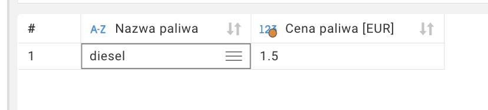

##### Tomasz Mycielski

# Zaawansowane systemy baz danych -- projekt

## Case study: Firma transportowa Eltrans

Eltrans to prężnie działająca firma transportowa, operująca zarówno na rynku krajowym, jak i międzynarodowym. Firma dysponuje zróżnicowaną flotą liczącą około 300 pojazdów, z czego większość stanowią tiry, uzupełnione o samochody osobowe i vany. Eltrans zatrudnia kilkuset pracowników, w większości kierowców, lecz także personel administracyjny, mechaników oraz specjalistów ds. logistyki.

Głównym wyzwaniem dla Eltrans jest efektywne zarządzanie zróżnicowaną flotą pojazdów i licznym personelem. Firma potrzebuje narzędzia do monitorowania wydajności, optymalizacji tras, kontroli kosztów oraz wykrywania nadużyć (fraudów). Dodatkowo, Eltrans chce wzmocnić swoje możliwości analityczne, aby podejmować trafniejsze decyzje biznesowe oparte na danych.

Baza danych, która ma usprawnić działanie firmy, będzie centralnym punktem gromadzenia i analizy informacji o pracownikach, pojazdach (z uwzględnieniem ich typów), trasach i historycznym stanie pojazdów podczas całego cyklu ich eksploatacji. Dzięki niej, Eltrans będzie w stanie:

- Analizować pracę kierowców
- Monitorować wykorzystanie pojazdów
- Analizować opłacalność poszczególnych tras i zleceń, z uwzględnieniem specyfiki różnych typów pojazdów
- Generować raporty i analizy wspierające podejmowanie decyzji strategicznych
- Wykrywać nadużycia, których dopuszczają się pracownicy firmy

Wdrożenie tego systemu pozwoli Eltrans na zwiększenie efektywności operacyjnej, redukcję kosztów oraz poprawę jakości świadczonych usług. To z kolei przełoży się na wzmocnienie pozycji firmy na konkurencyjnym rynku transportowym, umożliwiając jej lepsze wykorzystanie zróżnicowanej floty pojazdów i efektywniejsze zarządzanie zasobami ludzkimi, oraz oczywiście zwiększenie zysków.

## RDBMS

Na potrzeby tego projektu do zarządzania relacyjną bazą danych wykorzystany zostanie system **PostgreSQL**. Używałem tego systemu już wcześniej i nie miałem z nim problemu. Postgres ma ogromną społeczność, więc nawet jeśli napotkam jakiś problem, to na pewno szybko znajdę jego rozwiązanie w internecie. Korzystanie z Postgresa jest darmowe (open source), a instalacja jest dziecinnie prosta. Korzystam z `helm` ([chart od Bitnami](https://bitnami.com/stack/postgresql/helm)) do utworzenia instancji Postgresa na moim klastrze `k3s`, do którego dostęp mam przez WireGuard (Tailscale).

Screenshoty z działającego Postgresa:


## Projekt bazy danych

### ERD

[](https://mermaid.live/edit#pako:eNp9ksGOgyAQhl-FzLl9AW-mkqxJ291otycvs4rVVMQAtjHquy9IWZs2WU7w55v55wdGyEXBIAAmoxovEnnWErNOSfzldmf6Ee_21MthvKeJO6Shl6MkPnv1QMP0O6EHejw5YRcmkW91jD4NtlqQWWy3YvJ9SUAy0HhlLbnXusrghZwmP85CFrK-_YO6qZ7An8Fib2O-tF5nKKXga4WN61GbyXIdDoqUQnr7Z8al9d0U6RrMGUHt2fV23itqpXqmVm8XhUyTua3xz70STbFAsAHOJMe6MC852hJjWjHOMljio7xabDYc9lqkQ5tDoGXPNiBFf6kgKLFR5tR3BWr2-AkPdf4Fgmqj0g)

## Implementacja bazy danych

### Schemat logiczny

[

Wszystkie tabele są w jednym schemacie bazodanowym.

#### Tabele niezależne

1. `measurement`

    Zawiera pomiary poziomu paliwa podczas jazdy samochodu.

2. `trip`

    Zawiera informacje o trasach pokonanych przez samochody.

3. `card`

    Zawiera informacje o kartach flotowych, których używają kierowcy podczas transakcji na stacjach paliw.

4. `vendor`

    Zawiera informacje o dostawcach paliwa, z którymi firma ma podpisane umowy.

5. `vehicle`

    Zawiera informacje o samochodach, którymi operuje firma.

6. `trailer`

    Zawiera informacje o naczepach, którymi operuje firma.

7. `driver`

    Zawiera informacje o kierowcach zatrudnionych w firmie.

8. `sale`

    Zawiera informacje o transakcjach zakupu paliwa dokonanych przez kierowców.

#### Tablice słownikowe

1. `vehicle_type`
2. `fuel_type`

## Odstępstwa od 3NF

## Istotne decyzje projektowe

## Generowanie danych

## Użytkownicy

## Przykładowe zapytania

### Którzy kierowcy wykonali najwięcej tras w danym miesiącu?

```sql
SELECT driver.first_name,
       driver.last_name,
       count(*) AS trips_taken
FROM driver
JOIN trip ON driver.id=trip.driver_id
WHERE trip.start_time>='2024-01-01'
  AND trip.end_time<'2024-02-01'
GROUP BY driver.first_name,
         driver.last_name
ORDER BY trips_taken DESC
LIMIT 10;
```


### Jaka jest średnia cena oleju napędowego w Polsce?

W tym zapytaniu wykorzystane zostało **podzapytanie**.

```sql
SELECT ft.name AS "Nazwa paliwa",
       ROUND(CAST(sum(fuel_amount) / sum(cost) AS numeric), 2) AS "Cena paliwa [EUR]"
FROM sale s
JOIN fuel_type ft ON ft.id = s.fuel_type_id
WHERE vendor_id IN
    (SELECT id
     FROM vendor
     WHERE country = 'Poland')
  AND ft.name = 'diesel'
GROUP BY ft.name;
```



## Perspektywy

### Wykrywanie fraudów

### TODO: drugi view

## Indeksy

W bazie stworzyłem indeksy aby przyspieszyć niektóre zapytania. Tam, gdzie zapytania mają formę przyrównania do konkretnej wartości (na przykład numer rejestracyjny) wykorzystany został indeks typu hash. W przeciwnym wypadku, oraz w indekach złożonych z kilku kolumn, wykorzystałem indeks btree.

### `trip`

Utworzone zostały indeksy typu hash na kolumnach `source` i `destination` aby przyspieszyć zapytania o miejsca, gdzie jeżdżą pojazdy.

### `vendor`

Utworzony został indeks typu hash na kolumnie `country` aby przyspieszyć zapytania o kraje w których zarejestrowane są działaności dostawców paliwa.

### `sale`

Utworzony został indeks btree na kolumnie `cost` zawierający wartości `cost`, `fuel_amount` i `vendor_id` aby przyspieszyć zapytania o średnie ceny paliwa u dostawców.

### `driver`

Utworzony został indeks złożony typu btree na kolumnach `first_name` i `last_name` aby przyspieszyć zapytania o kierowców przy użyciu ich imion (w przeciwieństwie do ich `id`).

### `vehicle` i `trailer`

W obu tabelach utworzono indeksy typu hash na kolumnach z numerami rejestracyjnymi.
